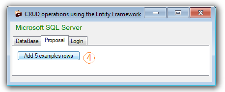

# Entity Framework with SqlServer

The application demonstrates the use of Entity Framework to perform simple CRUD operations on a Microsoft SQL Server database using WinForm windows.

The structure of the table is defined by the POCO (CPerson) class. The class (PeopleDBContext) creates a context (dbPersons) that represents a table (Sprinters) in the form of an object. Operations on this object are automatically transferred to the table (Sprinters) in the database.

## Using the application

- On the (Login) tab, enter the login information from SQL Server
- Check the connection with the button 2 (Check Connection)
- For valid data, a message will be shown: (Connection Good)

- In the (Proposal) tab, press the (4) button. The application should automatically create a table (Sprinters) on SQL Server

- In the (DataBase) tab you can: (5) read the table from the SQL server, (6) add rows, (7) delete rows. 

## Details

- Environment: VS2019
- Target Framework: .NET Framework 4.7.2
- Window: WinForm

